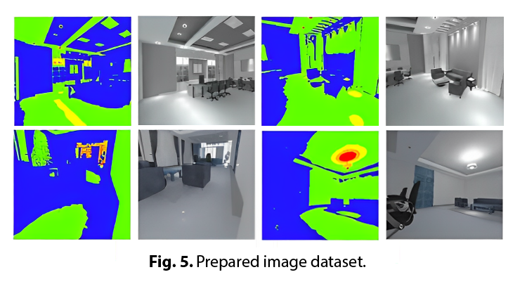
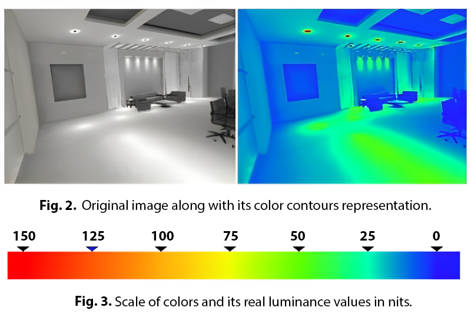
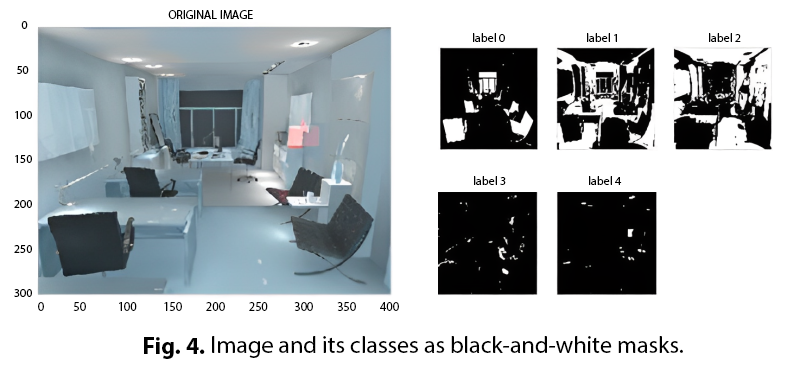

# Recovery of Optical Parameters Using FCNN

This repository contains the implementation of the paper "Recovery of optical parameters of a scene using fully convolutional neural networks" by Maksim Sorokin, Dmitry Zhdanov, and Andrey Zhdanov from ITMO University, St. Petersburg, Russia.

## Description

The project focuses on the use of Fully Convolutional Neural Networks (FCNN) to recover the position and optical parameters of light sources in a scene. The FCNN is trained to capture the 'behavior of light' features, with the output being a segmented image with luminance levels. This approach is particularly relevant for virtual and augmented reality systems, where the accurate representation of lighting conditions is crucial for creating a natural and immersive experience.

The research also discusses the challenges and future improvements in the field, such as classifying diffuse and mirror reflections, and improving the classification of illuminance values and bounding boxes of light sources.

## Method

The method used in this research involves the use of a FCNN, part of which is the VGG16-Net architecture. The FCNN is trained on a dataset of 291 images with their color contours representation. The output of the FCNN is a segmented image with luminance levels, which allows for the classification of the input image into certain classes of illumination. 

The training of the FCNN was conducted on 221 train images and 29 validation images with a learning rate of 0.01 and 200 epochs. The loss after training was 0.2. An “intersection over union” method was used as a test, comparing the ground truth area of an input image and output image, and giving the accuracy as a result. The mean intersection is 0.7, almost rightly classifying the first class with a value of 90 percent of accordance and the last class with a probability of 30 percent.

## Usage/Examples

Usage examples are structured as notebooks. 

## Dataset

The dataset used in this research was obtained using Lumicept, a hybrid light simulation software that enables the virtual measurement of photometric and radiometric quantities without making prototypes. Lumicept is known for its fast and accurate light propagation calculation and fascinating rendering capability comparable to that of computer graphics software. It provides a powerful tool for modeling light propagation, ensuring proper optical parameters and classification of parameters.

## Achieved results:

  

The full paper via link http://ceur-ws.org/Vol-2344/short1.pdf

## Acknowledgements

This work was funded by the Russian Science Foundation (project No. 18-79-10190). We express our gratitude for their support.
